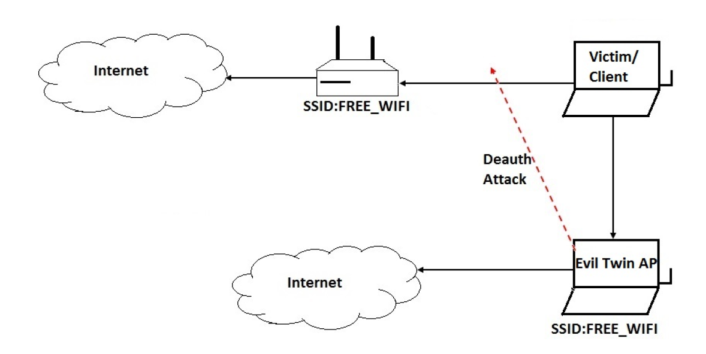

# 📡 Evil Twin Attack Suite & Defense

## Overview

This project includes an **Evil Twin Attack toolkit** (offensive) and two **detection mechanisms** (defensive) — a **Machine Learning-based IDS** and a **Manual Defense Sniffer** — that are designed for educational and authorized penetration testing.

---

## 🚨 Evil Twin Attack Toolkit

- **Purpose:** Simulates a rogue access point that mimics a real Wi-Fi network, forcing users to disconnect and reconnect to the attacker's fake AP. The attacker can then capture credentials or manipulate user traffic.
- **Key Scripts:**
  - **main.py:** Orchestrates the entire Evil Twin attack flow.
  - **beacon_spoofer.py:** Uses hostapd to broadcast a fake AP with the same SSID as the legitimate network.
  - **deauth.py:** Sends deauthentication frames (via Scapy) to disconnect clients from the real AP, forcing them to connect to the fake one.
  - **client_scanner.py:** Identifies client devices (stations) connected to the real AP, useful for targeting specific victims.
  - **dnsmasq.conf & hostapd.conf:** Provide DHCP/DNS redirection and Wi-Fi configurations for the fake AP.
  - **web_server/server.py:** Hosts a captive portal (login page) using Flask, capturing credentials or simulating phishing attacks.
- **Attack Logic:** The attacker deauthenticates clients from the real AP, then uses a cloned SSID to lure them into connecting to the rogue AP. The captive portal then captures credentials.

---

## 🔎 Detection Mechanisms

### 1️⃣ Machine Learning-Based IDS

- **Purpose:** Real-time classification of packets using features extracted from live network traffic.
- **Dataset:** AWID3 dataset ([AWID3](https://icsdweb.aegean.gr/awid/awid3)), preprocessed and labeled with 'Normal', 'Evil_Twin', and 'Deauth' classes.
- **Feature List:** Includes fields like `wlan.fc.type`, `wlan_radio.data_rate`, `frame.len`, etc., derived from tshark captures. These features represent packet-level statistics.
- **Script Summary:**
  - Uses **tshark** to capture packets live and extract features defined in a `feature_header.txt` file.
  - Applies a **RandomForestClassifier** to classify each packet as Normal, Evil_Twin, or Deauth.
  - Continuously prints alerts if suspicious activity is detected.
  - **Logic:** Every line of live capture is parsed, missing values are replaced with zeros, and each row is classified. If the label is not 'Normal', an alert is printed.

### 2️⃣ Manual Defense Sniffer

- **Purpose:** Uses scapy to sniff Wi-Fi packets in real time and manually identify suspicious APs and deauth attacks.
- **Script Summary:**
  - Starts by setting the interface to monitor mode and channel hopping across Wi-Fi channels.
  - **Deauthentication Detection:**
    - Counts the number of unprotected deauth/disas frames sent by the real AP or to the user’s device.
    - If the count exceeds a threshold within a time window, an alert is triggered.
  - **Evil Twin Detection:**
    - Monitors beacon frames.
    - If a beacon has the same SSID as the real AP but a different BSSID, it increments a counter for that BSSID.
    - After a time window, if a suspicious BSSID appears too many times, an alert is triggered.
  - **Logic:** Relies on thresholds for suspicious frames and channel hopping to catch APs on all channels.
  - - **Defense**:
    - When an Evil Twin is detected, the script can launch a **countermeasure**: it sends deauth packets **back to the Evil Twin AP** using the `send_deauth_to_ap` function (detailed below).
    - **Logic**:
      - Uses `scapy` to craft a deauthentication frame with:
        - `addr1`: the broadcast address (so all clients see it)
        - `addr2` and `addr3`: the attacker’s Evil Twin BSSID.
      - Sends this packet multiple times (default 5) to disrupt the fake AP’s connectivity and potentially disconnect its clients.

---

## 📝 Summary

| Component               | Description |
|-------------------------|-------------|
| **Evil Twin Attack Suite** | Offensive toolkit: fake AP (hostapd), deauth frames (Scapy), captive portal (Flask). |
| **Machine Learning IDS**  | Real-time detection using RandomForest trained on AWID3, using packet features from tshark. |
| **Manual Defense Sniffer** | Real-time detection using scapy, thresholds, and BSSID/SSID logic, with channel hopping. |

**Note:** For training the ML model, we used the AWID3 dataset: [AWID3](https://icsdweb.aegean.gr/awid/awid3).
